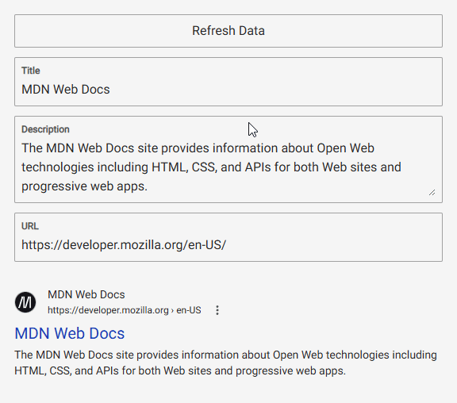

# SERPA

A browser extension that simulates how a website appears in Google search results. Edit the title, description, and URL to
preview different variations. 

---

<section>
  
  
</section>

---

## Installation

TODO

## Notes

Google Search algorithm is complex and considers countless factors beyond title, description, and URL. The preview provides a general
indication of appearance but might not be an exact representation of actual search results.
